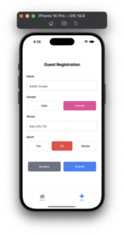

# Wedding Planner App

A modern, cross-platform wedding guest management application built with React Native and Expo. This app helps couples manage their wedding guest list with features like guest registration, RSVP tracking, and comprehensive guest statistics.

## ✨ Features

### 🎯 Core Functionality
- **Guest Registration**: Add new guests with name, gender, phone number, and RSVP status
- **Guest Management**: View, search, filter, and delete guests
- **RSVP Tracking**: Track guest responses (Yes, No, Maybe)
- **Real-time Statistics**: View guest count and attendance statistics
- **Data Persistence**: Secure local storage using Expo SecureStore

### 🎨 User Experience
- **Dark/Light Mode**: Automatic theme switching support
- **Responsive Design**: Optimized for all screen sizes
- **Pull-to-Refresh**: Easy data refresh functionality
- **Search & Filter**: Find guests quickly with advanced filtering
- **Intuitive UI**: Clean, modern interface with smooth animations

### 📱 Technical Features
- **Cross-platform**: Works on iOS, Android, and Web
- **TypeScript**: Full type safety and better development experience
- **NativeWind**: Utility-first CSS framework for styling
- **Expo Router**: File-based navigation system
- **Secure Storage**: Encrypted local data storage

## 🚀 Getting Started

### Prerequisites

Before running this project, make sure you have the following installed:

- **Node.js** (v18 or higher)
- **npm** or **yarn**
- **Expo CLI**: `npm install -g @expo/cli`
- **Expo Go app** on your mobile device (for testing)

### Installation

1. **Clone the repository**
   ```bash
   git clone https://github.com/RishitUmeshPadagatti/Guest-List-Manager.git
   cd my-app
   ```

2. **Install dependencies**
   ```bash
   npm install
   ```

3. **Start the development server**
   ```bash
   npm run start
   ```

4. **Run on specific platforms**
   ```bash
   # iOS Simulator
   npm run ios
   
   # Android Emulator
   npm run android
   
   # Web Browser
   npm run web
   ```

### 📱 Testing on Device

1. Install **Expo Go** from App Store (iOS) or Google Play Store (Android)
2. Run `npm start` in your terminal
3. Scan the QR code with your device's camera (iOS) or Expo Go app (Android)

## 📱 App Screenshots

### Guest List Screen


*Comprehensive guest management with search, filters, and statistics*

### Guest Registration Screen


*Clean form interface for adding new guests with validation*

### Dark Mode


*Beautiful dark theme with consistent styling across all components*

## 🛠️ Technologies Used

### Core Technologies
- **React Native** (0.79.6) - Cross-platform mobile development
- **Expo** (~53.0.22) - Development platform and tools
- **TypeScript** (~5.8.3) - Type-safe JavaScript
- **Expo Router** (~5.1.6) - File-based navigation

### UI & Styling
- **NativeWind** (^4.1.23) - Tailwind CSS for React Native
- **Tailwind CSS** (^3.4.17) - Utility-first CSS framework
- **React Native Safe Area Context** (^5.4.0) - Safe area handling

### Storage & Security
- **Expo SecureStore** (14.2.4) - Encrypted local storage
- **AsyncStorage** - Persistent data storage

### Development Tools
- **Prettier** - Code formatting
- **Babel** - JavaScript transpilation

## 📊 Data Models

### Guest Interface
```typescript
interface guestInterface {
    id: number;
    name: string;
    gender: 'Male' | 'Female';
    phone: number;
    rsvp: 'yes' | 'no' | 'maybe';
}
```

## 🔧 Available Scripts

- `npm start` - Start the Expo development server
- `npm run android` - Run on Android emulator/device
- `npm run ios` - Run on iOS simulator/device
- `npm run web` - Run in web browser
- `npm test` - Run the test suite

## 🎨 Theming

The app supports both light and dark modes with automatic switching based on system preferences. All components use themed colors that adapt to the current theme.

### Color Scheme
- **Primary**: Blue (#3B82F6)
- **Success**: Green (#10B981)
- **Warning**: Yellow (#F59E0B)
- **Error**: Red (#EF4444)
- **Neutral**: Gray scale for text and backgrounds

## 📱 Platform Support

- ✅ **iOS** (iOS 13+)
- ✅ **Android** (API level 21+)
- ✅ **Web** (Modern browsers)

## 🔒 Data Security

- All guest data is stored locally using Expo SecureStore
- Data is encrypted and secure on the device
- No external API calls or data transmission
- Privacy-focused design

## 🚀 Deployment

### Building for Production

1. **Configure app.json** with your app details
2. **Build for iOS**:
   ```bash
   expo build:ios
   ```
3. **Build for Android**:
   ```bash
   expo build:android
   ```

## 🤝 Contributing

1. Fork the repository
2. Create a feature branch (`git checkout -b feature/amazing-feature`)
3. Commit your changes (`git commit -m 'Add amazing feature'`)
4. Push to the branch (`git push origin feature/amazing-feature`)
5. Open a Pull Request